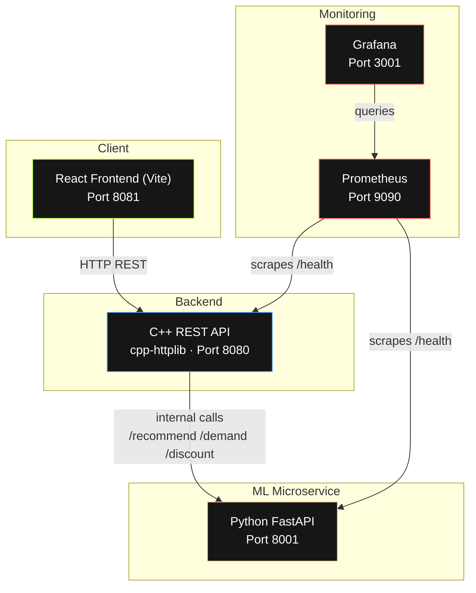

```mermaid
flowchart TB
    subgraph Client
        FE["React Frontend (Vite)<br/>Port 8081"]
    end

    subgraph Backend
        API["C++ REST API<br/>cpp-httplib · Port 8080"]
    end

    subgraph ML["ML Microservice"]
        MLAPI["Python FastAPI<br/>Port 8001"]
    end

    subgraph Monitoring
        PROM["Prometheus<br/>Port 9090"]
        GRAF["Grafana<br/>Port 3001"]
    end

    FE -- "HTTP REST" --> API
    API -- "internal calls<br/>/recommend /demand /discount" --> MLAPI
    PROM -- "scrapes /health" --> API
    PROM -- "scrapes /health" --> MLAPI
    GRAF -- "queries" --> PROM

    style FE fill:#161616,stroke:#b5ff4d,color:#fff
    style API fill:#161616,stroke:#4d9fff,color:#fff
    style MLAPI fill:#161616,stroke:#ffd166,color:#fff
    style PROM fill:#161616,stroke:#ff4d4d,color:#fff
    style GRAF fill:#161616,stroke:#ff4d4d,color:#fff
```
