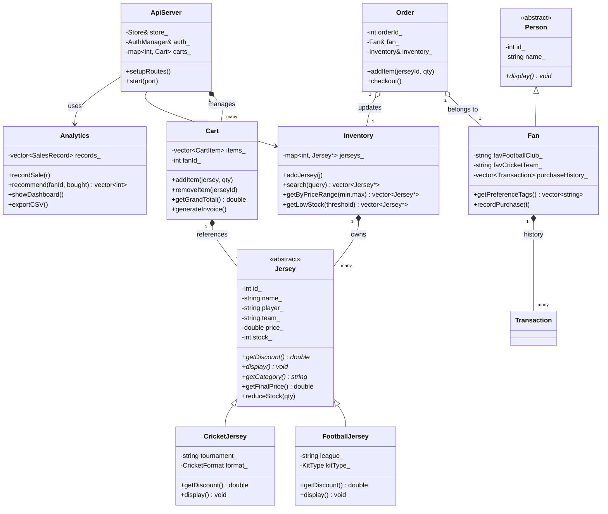

```mermaid
classDiagram
    class Jersey {
        <<abstract>>
        -int id_
        -string name_
        -string player_
        -string team_
        -double price_
        -int stock_
        +getDiscount() double*
        +display() void*
        +getCategory() string*
        +getFinalPrice() double
        +reduceStock(qty)
    }

    class FootballJersey {
        -string league_
        -KitType kitType_
        +getDiscount() double
        +display() void
    }

    class CricketJersey {
        -string tournament_
        -CricketFormat format_
        +getDiscount() double
        +display() void
    }

    class Person {
        <<abstract>>
        -int id_
        -string name_
        +display() void*
    }

    class Fan {
        -string favFootballClub_
        -string favCricketTeam_
        -vector~Transaction~ purchaseHistory_
        +getPreferenceTags() vector~string~
        +recordPurchase(t)
    }

    class Inventory {
        -map~int, Jersey*~ jerseys_
        +addJersey(j)
        +search(query) vector~Jersey*~
        +getByPriceRange(min,max) vector~Jersey*~
        +getLowStock(threshold) vector~Jersey*~
    }

    class Cart {
        -vector~CartItem~ items_
        -int fanId_
        +addItem(jersey, qty)
        +removeItem(jerseyId)
        +getGrandTotal() double
        +generateInvoice()
    }

    class Order {
        -int orderId_
        -Fan& fan_
        -Inventory& inventory_
        +addItem(jerseyId, qty)
        +checkout()
    }

    class Analytics {
        -vector~SalesRecord~ records_
        +recordSale(r)
        +recommend(fanId, bought) vector~int~
        +showDashboard()
        +exportCSV()
    }

    class ApiServer {
        -Store& store_
        -AuthManager& auth_
        -map~int, Cart~ carts_
        +setupRoutes()
        +start(port)
    }

    Jersey <|-- FootballJersey
    Jersey <|-- CricketJersey
    Person <|-- Fan
    Inventory "1" *-- "many" Jersey : owns
    Cart "1" *-- "many" Jersey : references
    Order "1" o-- "1" Fan : belongs to
    Order "1" o-- "1" Inventory : updates
    ApiServer "1" *-- "many" Cart : manages
    ApiServer --> Inventory : uses
    ApiServer --> Analytics : uses
    Fan "1" *-- "many" Transaction : history
```
